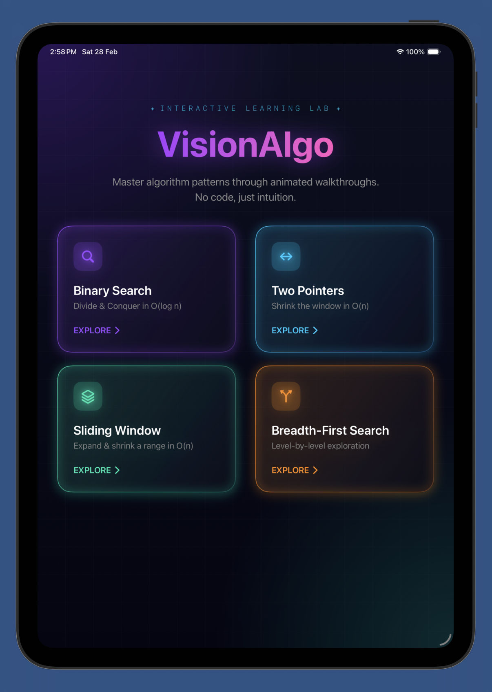
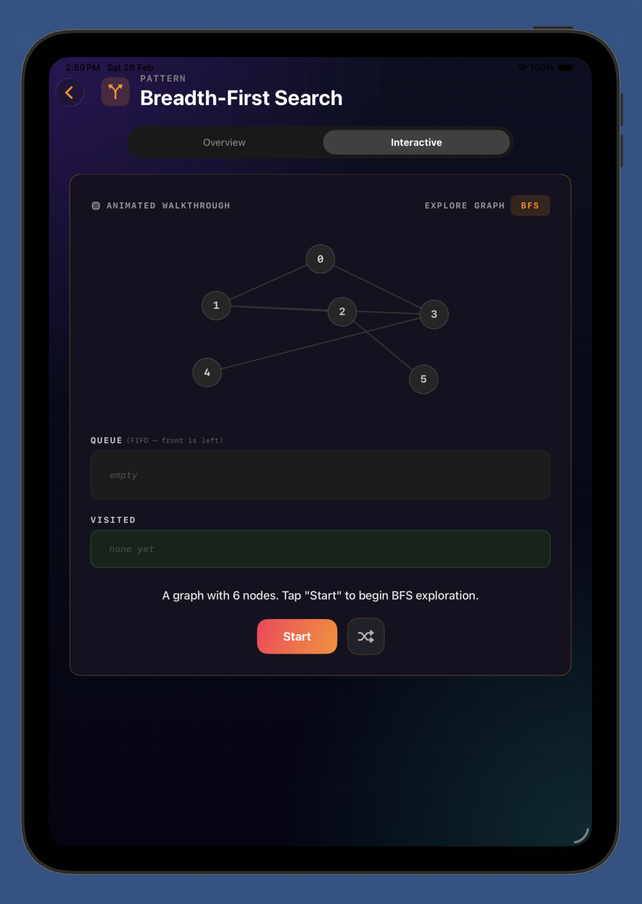
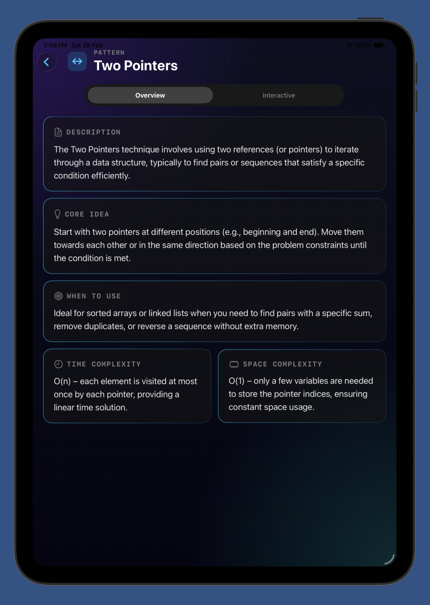

# AlgoVision

Interactive algorithm learning and visualization app built with **SwiftUI**.  
Designed to help students and developers understand algorithm behavior through **visual patterns, step-by-step execution, and interactive exploration**.

The project focuses on making complex algorithmic concepts intuitive through clean UI, animations, and structured explanations.

---

## Overview

AlgoVision is a SwiftUI-based learning tool that combines **algorithm theory with visual simulation**.  
Instead of reading static pseudocode, users can observe how algorithms operate internally.

Core goals:

- Visual understanding of algorithm patterns
- Interactive exploration of algorithm behavior
- Clean, minimal UI focused on learning
- Educational tool for computer science students

---

## Features

### Algorithm Visualization
- Real-time visual representation of algorithm execution
- Step-by-step progression
- Pattern and structure visualization

### Learning Module
- Concept explanations
- Algorithm breakdowns
- Logical flow understanding

### Interactive Interface
- SwiftUI based responsive UI
- Structured navigation between learning and visualization
- Lightweight and optimized design

---

## Screenshots

<p align="center">
  
  
  
</p>

---

## Project Structure
```
AlgoVision
│
├── AlgoVision.swiftpm
│ ├── Package.swift
│ ├── VisionAlgoApp.swift
│ ├── HomeView.swift
│ ├── AlgoPattern.swift
│ └── Views/
│
├── README.md
└── LICENSE
```

Main components:

- **VisionAlgoApp.swift** – Application entry point
- **HomeView.swift** – Main UI navigation
- **AlgoPattern.swift** – Algorithm pattern logic
- **Views/** – Visualization and UI components

---

## Technology Stack

- **Swift**
- **SwiftUI**
- **Swift Package Manager**
- **Xcode / Swift Playgrounds**

---

## Installation

1. Clone the repository: *git clone https://github.com/Adi-1515/AlgoVision.git*
2. Navigate to the project.
3. Open in Xcode or Swift Playgrounds.
4. Choose iPhone or iPad simulator.
5. Finally build and run the project.

---

## Educational Purpose

AlgoVision is built as a **learning tool for computer science students**, helping bridge the gap between theoretical algorithms and their actual execution.

It focuses on visual intuition rather than purely textual explanations.

---

## Future Improvements

- More algorithm visualizations
- Interactive user controls for algorithm parameters
- Additional learning modules
- Improved animations and graphics
- Performance benchmarking views

---

## Contributing

Contributions that improve visualization quality, UI design, or algorithm coverage are welcome.

### Typical Workflow

1. Fork the repository
2. Create a new feature branch
3. Commit your changes
4. Push the branch to your fork
5. Open a Pull Request

---

## License

This project is licensed under the MIT License.

See the `LICENSE` file for details.
